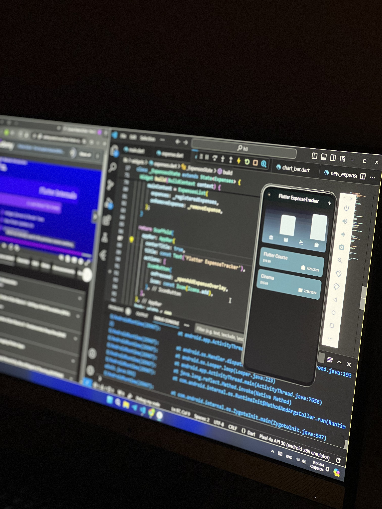
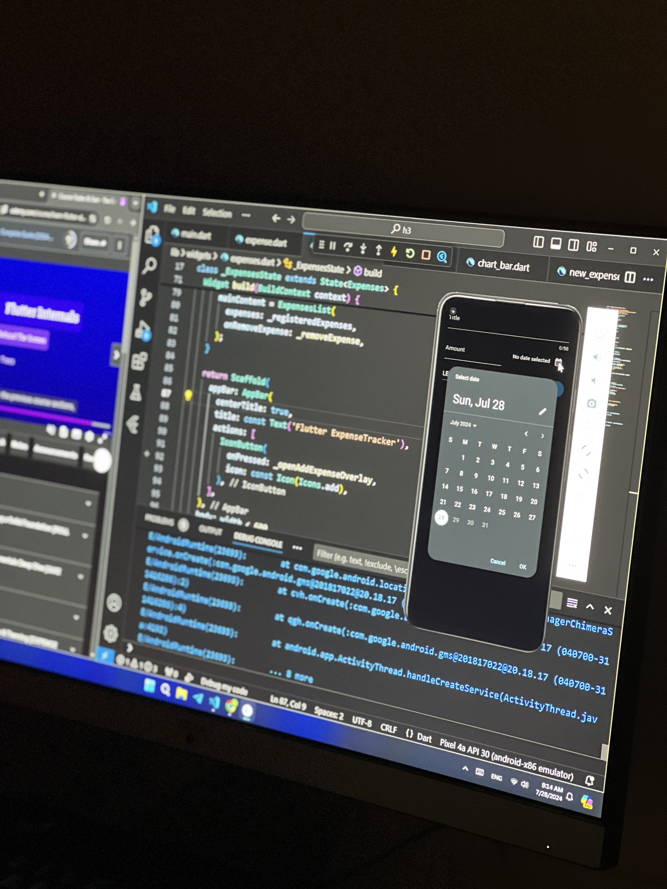

# Expenses Tracker App

Welcome to the Expenses Tracker App, a practical application developed using Flutter. This app helps users keep track of their expenses and manage their budget efficiently.

## Features

- **Add Expenses**: Easily add new expenses with details such as amount, category, and date.
- **View Summary**: Get a summary of your expenses with totals and categories.
- **Expense History**: Review past expenses with a clean and organized interface.

## Installation

To get started with this project, follow these steps:

1. **Clone the Repository:**
   ```bash
   git clone https://github.com/hissahKhalid/expenses-tracker-app.git
2. **Navigate to the Project Directory:**
    ```bash
    cd expenses-tracker-app
3. **Install Dependencies:**
   ```bash
   flutter pub get
4. **Run the Application:**
   ```bash
   flutter run

## Usage
- **Add Expenses:** Press the button to add a new expense, filling in the details such as amount and category.
- **View Summary:** Access the summary page to see an overview of your expenses.
- **Expense History:** Navigate to the history section to review and manage past expenses.

## Screenshots

<div style="display: flex; gap: 10px;">
  
  
</div>

## Contributing
If you want to contribute to this project, feel free to open issues or submit pull requests. Your feedback and contributions are highly appreciated!

## Contact
For any questions or feedback, you can reach out to me at [Hissah.khalid@hotmail.com](mailto:Hissah.khalid@hotmail.com). 

## License
 ```bash
  Copyright 2024 Hissah Khalid.
